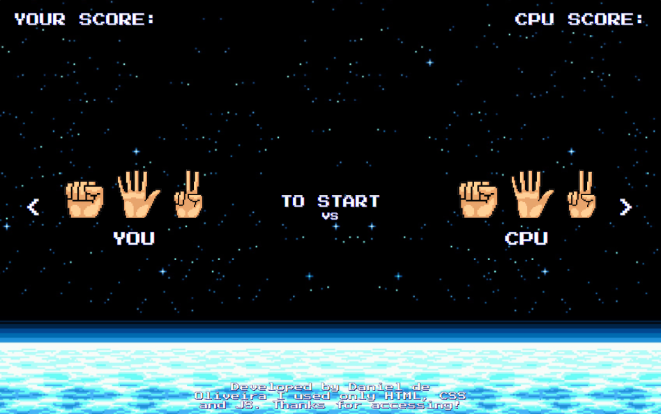

#

 
<h3 align="center">🎮 História do Projeto</h3>
 

Desenvolvi este projeto após relembrar da minha infancia, da época que eu jogava no Nintendo... Eu iniciei com wireframes fazendo toda a prototipação e ai parti para o Figma e criei o layout. Após terminar iniciei o desenvolvimento. Utilizando somente: HTML, CSS e JS!

 

<h3 align="center">O que foi utilizado 👇🏻</h3>

 

  

 

 

 

<a href="https://game-jokenpo.surge.sh/"><b>Clique aqui e acesse o jogo</b></a> 

